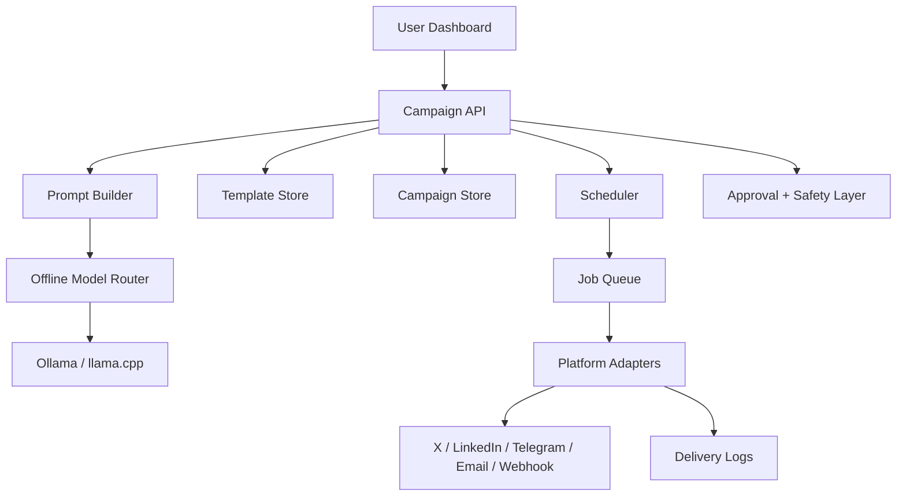

# HELIX Local Marketing System Walkthrough

## Goal

Build Helix as a local-first, edge-integrated AI marketing system that can:

- generate marketing text offline
- store reusable templates and campaign variants
- schedule content delivery
- publish to multiple platforms from one campaign
- run primarily on a local machine or local server
- avoid cloud dependency for core generation and scheduling

This document is a practical implementation walkthrough for building that system inside the current `D:\ECHO V1` workspace.

## Product Direction

The new Helix is not just a chat assistant. It becomes a local AI marketing operator with five core jobs:

1. Understand campaign intent from the user.
2. Generate platform-specific marketing copy offline.
3. Save templates, drafts, and publishing rules.
4. Schedule distribution across selected channels.
5. Execute posting jobs and track status locally.

## Local-First System Scope

### Core capabilities

- Offline content generation with local GGUF or Ollama models
- Campaign workspace with templates, variants, and asset references
- Channel adapters for multiple platforms
- Job scheduler for timed posting
- Approval queue before publish
- Audit logs and retry handling

### Recommended first release

Start with:

- X/Twitter
- LinkedIn
- Telegram
- Email/newsletter
- Webhook output

Add Instagram, Facebook Pages, and WhatsApp only after the scheduling and approval pipeline is stable.

## Target Architecture



## Recommended Local Stack

### Backend

- `FastAPI` for APIs
- `APScheduler` for scheduling
- `SQLModel` or `SQLAlchemy` with SQLite for local persistence
- `httpx` for platform API calls
- `pydantic` for schemas

### AI runtime

- `Ollama` for simple local serving
- existing `llama.cpp` sidecar in `helix_backend/edge_model`
- use one local small/medium instruct model for generation

Recommended local models:

- `qwen2.5:3b-instruct`
- `llama3.2:3b`
- `mistral:7b-instruct` if hardware allows

### Frontend

- existing `helix-frontend` React app
- add campaign builder, template library, scheduler view, and publish queue

### Local storage

- SQLite for campaigns, templates, schedules, logs
- local filesystem for exported assets and generated drafts

## Proposed Repo Structure

Add these modules under `helix_backend/fullstack`:

```text
helix_backend/fullstack/
  marketing/
    __init__.py
    models.py
    schemas.py
    repository.py
    prompt_engine.py
    campaign_service.py
    template_service.py
    scheduler_service.py
    delivery_service.py
    approval_service.py
    safety_service.py
    adapters/
      __init__.py
      base.py
      twitter.py
      linkedin.py
      telegram.py
      email.py
      webhook.py
```

Add these frontend pages:

```text
helix-frontend/src/pages/
  MarketingDashboard.jsx
  CampaignBuilderPage.jsx
  TemplatesPage.jsx
  SchedulerPage.jsx
  DeliveryLogsPage.jsx
```

## Core Data Model

Use SQLite first. You do not need Supabase for the first local version.

### Tables

#### `campaigns`

- `id`
- `name`
- `goal`
- `target_audience`
- `brand_voice`
- `offer_summary`
- `status`
- `created_at`
- `updated_at`

#### `campaign_variants`

- `id`
- `campaign_id`
- `platform`
- `variant_name`
- `prompt_snapshot`
- `generated_text`
- `cta`
- `hashtags`
- `approval_status`
- `created_at`

#### `templates`

- `id`
- `name`
- `category`
- `platform`
- `template_text`
- `tone`
- `cta_style`
- `created_at`

#### `scheduled_jobs`

- `id`
- `campaign_id`
- `variant_id`
- `platform`
- `run_at`
- `timezone`
- `status`
- `retry_count`
- `last_error`
- `created_at`

#### `delivery_logs`

- `id`
- `job_id`
- `platform`
- `request_payload`
- `response_payload`
- `status`
- `external_post_id`
- `created_at`

#### `channel_credentials`

- `id`
- `platform`
- `account_label`
- `encrypted_secret_blob`
- `created_at`

## End-to-End User Flow

### Step 1: Create a campaign

The user enters:

- campaign name
- target audience
- product or offer
- goal
- platforms
- posting schedule
- tone

### Step 2: Generate variants offline

Helix builds prompts and generates:

- X short post
- LinkedIn professional post
- Telegram announcement
- email subject line
- email body

### Step 3: Review and approve

The user edits or approves each variant.

### Step 4: Schedule

Each approved variant becomes a scheduled job.

### Step 5: Dispatch

The scheduler wakes up, finds due jobs, sends them through platform adapters, and records logs.

## Backend Build Walkthrough

## Phase 1: Create the local marketing module

Create the folder:

```powershell
New-Item -ItemType Directory -Force -Path 'D:\ECHO V1\helix_backend\fullstack\marketing\adapters'
```

Add:

- `models.py`
- `schemas.py`
- `repository.py`
- `campaign_service.py`
- `scheduler_service.py`
- `delivery_service.py`

## Phase 2: Define schemas

Create request and response models for:

- `CreateCampaignRequest`
- `GenerateVariantsRequest`
- `ScheduleCampaignRequest`
- `ApproveVariantRequest`
- `DeliveryLogResponse`

Include:

- `platforms: list[str]`
- `run_at: datetime`
- `timezone: str`
- `offline_only: bool = True`

## Phase 3: Build campaign persistence

Use SQLite first because it is simpler and fully local.

Recommended database path:

`D:\ECHO V1\memory\helix_marketing.db`

### Local setup

Install dependencies:

```powershell
Set-Location -LiteralPath 'D:\ECHO V1'
.venv\Scripts\activate
python -m pip install sqlmodel apscheduler httpx cryptography
```

## Phase 4: Build the offline prompt engine

The prompt engine should transform user input into platform-ready copy.

### Prompt inputs

- brand name
- campaign goal
- audience
- tone
- platform
- CTA
- product context
- template style

### Prompt rules

- Keep X concise and hook-first
- Keep LinkedIn insight-driven and professional
- Keep Telegram direct and announcement-oriented
- Keep email structured with subject plus body
- Always output plain text plus optional metadata

### Output contract

Every generation call should return:

```json
{
  "headline": "string",
  "body": "string",
  "cta": "string",
  "hashtags": ["string"],
  "platform": "x"
}
```

## Phase 5: Connect to Ollama or local edge engine

You already have edge foundations in:

- `D:\ECHO V1\helix_backend\edge_model\engine.py`
- `D:\ECHO V1\helix_backend\Core_Brain\nlp_engine\nlp_engine.py`

For the marketing system, keep generation deterministic.

### Recommended generation settings

- temperature: `0.5` to `0.75`
- max tokens: platform-dependent
- shorter context windows
- explicit output format

### Suggested routing logic

- use Ollama for campaign generation
- use local cache for repeated prompts
- keep cloud disabled by default for this subsystem

## Phase 6: Build platform adapters

Create one adapter per channel.

### Adapter interface

Each adapter should expose:

- `validate_credentials()`
- `format_payload(variant)`
- `send(payload)`
- `dry_run(payload)`

### X/Twitter adapter

Responsibilities:

- enforce character limits
- shorten links if needed
- publish thread if content exceeds single-post length

### LinkedIn adapter

Responsibilities:

- support longer professional posts
- keep newline formatting stable
- attach asset references later

### Telegram adapter

Responsibilities:

- send to channel or group via bot token
- support markdown-safe formatting

### Email adapter

Responsibilities:

- use SMTP locally or service relay
- support subject/body generation

### Webhook adapter

Responsibilities:

- send campaign payload to any external automation stack
- useful for Zapier, n8n, Make, or internal tools

## Phase 7: Build the scheduler

Use `APScheduler`.

### Scheduler responsibilities

- load scheduled jobs on startup
- enqueue due jobs
- retry failed jobs
- mark success or failure
- support pause, resume, cancel

### Local job strategy

Do not post directly inside the scheduler callback.

Instead:

1. Scheduler marks jobs as due.
2. Delivery worker picks them up.
3. Worker calls platform adapter.
4. Worker writes delivery logs.

This separation keeps the system debuggable.

## Phase 8: Approval and safety layer

This is necessary because marketing automation can cause accidental spam.

### Approval rules

- first version requires manual approval before scheduling
- edited text invalidates prior approval
- rejected variants cannot be scheduled

### Safety rules

- rate limit posts per platform
- duplicate-content detection
- blocked phrase list
- URL validation
- account-level cooldowns

## API Design

Add these endpoints to `helix_backend/fullstack/main.py` or a new router file.

### Campaign APIs

- `POST /api/marketing/campaigns`
- `GET /api/marketing/campaigns`
- `GET /api/marketing/campaigns/{campaign_id}`
- `POST /api/marketing/campaigns/{campaign_id}/generate`
- `POST /api/marketing/variants/{variant_id}/approve`
- `POST /api/marketing/variants/{variant_id}/reject`

### Scheduling APIs

- `POST /api/marketing/campaigns/{campaign_id}/schedule`
- `GET /api/marketing/schedules`
- `POST /api/marketing/schedules/{job_id}/pause`
- `POST /api/marketing/schedules/{job_id}/resume`
- `DELETE /api/marketing/schedules/{job_id}`

### Delivery APIs

- `POST /api/marketing/variants/{variant_id}/dry-run`
- `POST /api/marketing/jobs/{job_id}/dispatch-now`
- `GET /api/marketing/delivery-logs`

## Frontend Build Walkthrough

## Marketing dashboard

Add a dashboard with:

- total campaigns
- posts due today
- failed jobs
- approval queue

## Campaign builder

The builder should collect:

- brand/product
- audience
- campaign objective
- platforms
- schedule
- tone
- CTA style

## Template library

Allow users to:

- save templates
- duplicate templates
- tag templates by platform and tone
- reuse winning copy structures

## Scheduler page

Show:

- all scheduled jobs
- next run time
- platform
- approval state
- retry state

## Delivery logs page

Show:

- sent status
- failed status
- error message
- published platform
- external post id

## Local Environment Setup

## Step 1: Python environment

```powershell
Set-Location -LiteralPath 'D:\ECHO V1'
python -m venv .venv
.venv\Scripts\activate
python -m pip install --upgrade pip
python -m pip install -r requirements.txt
python -m pip install -r helix_backend\requirements_fullstack.txt
python -m pip install sqlmodel apscheduler httpx cryptography aiosqlite
```

## Step 2: Start Ollama

Install Ollama locally, then pull a model:

```powershell
ollama pull qwen2.5:3b
ollama serve
```

If you prefer the existing GGUF sidecar, keep using the local model path already configured in `helix_backend`.

## Step 3: Local environment variables

Add to `.env`:

```env
HELIX_API_TOKEN=dev-token
HELIX_USE_LOCAL_LLM=true
HELIX_MODEL_VERSION=marketing-local-v1
HELIX_EDGE_IDLE_TIMEOUT_SECONDS=1800
HELIX_MARKETING_DB_PATH=memory/helix_marketing.db
OLLAMA_BASE_URL=http://localhost:11434
OLLAMA_MODEL=qwen2.5:3b
```

For platform credentials, do not hardcode secrets in source files.

Use encrypted local storage or environment variables such as:

```env
HELIX_X_BEARER_TOKEN=
HELIX_LINKEDIN_ACCESS_TOKEN=
HELIX_TELEGRAM_BOT_TOKEN=
HELIX_TELEGRAM_CHAT_ID=
HELIX_SMTP_HOST=
HELIX_SMTP_PORT=
HELIX_SMTP_USER=
HELIX_SMTP_PASSWORD=
```

## Step 4: Run backend

```powershell
Set-Location -LiteralPath 'D:\ECHO V1'
.venv\Scripts\activate
uvicorn helix_backend.fullstack.main:app --reload --port 8000
```

## Step 5: Run frontend

```powershell
Set-Location -LiteralPath 'D:\ECHO V1\helix-frontend'
$env:VITE_BACKEND_URL='http://localhost:8000'
$env:VITE_API_TOKEN='dev-token'
npm install
npm run dev
```

## Scheduling Strategy

Use user-local timezone-aware scheduling.

### Recommended rules

- store timestamps in UTC
- store user timezone separately
- compute next execution server-side
- use idempotency keys for each job dispatch

### Retry policy

- first retry after 1 minute
- second retry after 5 minutes
- third retry after 15 minutes
- then mark failed and require manual review

## Prompt Design For Marketing Generation

Keep prompting structured.

### Base prompt

```text
You are Helix Marketing, a local offline AI copy engine.
Generate platform-specific marketing text.
Keep the message clear, conversion-oriented, and aligned to the requested tone.
Return clean output only.
```

### Platform prompt extension

For X:

- start with a hook
- keep under character budget
- add compact CTA

For LinkedIn:

- lead with insight or pain point
- use scannable line breaks
- close with a clear CTA

For Telegram:

- keep direct and timely
- avoid long paragraphs

For Email:

- output subject line
- output preview line
- output body

## Local Testing Plan

## Unit tests

Write tests for:

- prompt generation
- scheduler job creation
- duplicate detection
- adapter payload formatting
- approval rules

## Integration tests

Write tests for:

- generate campaign variants locally
- schedule approved variants
- dry-run a dispatch
- log a simulated delivery result

## Manual acceptance tests

1. Create a campaign.
2. Generate variants for at least 3 platforms.
3. Approve one variant and reject one.
4. Schedule approved variant 2 minutes ahead.
5. Confirm dry-run dispatch works.
6. Confirm delivery log is recorded.

## Security and Compliance Notes

This system touches real platform accounts. Treat it as an automation product, not just a text generator.

### Minimum protections

- encrypt stored credentials
- do not auto-publish unapproved content
- enforce per-platform rate limits
- log all outbound payloads
- provide a kill switch to disable all scheduled dispatches

### Important product constraint

Avoid building spam behavior. The system should publish user-approved campaign content, not mass unsolicited content.

## Recommended Build Order

Build in this order:

1. Local SQLite marketing schema
2. Campaign CRUD APIs
3. Offline prompt engine with Ollama
4. Variant generation UI
5. Approval workflow
6. APScheduler-based job runner
7. Webhook and Telegram adapters
8. X and LinkedIn adapters
9. Delivery logs and retries
10. Credential encryption and admin controls

## Definition Of Done For V1

Helix Marketing Local V1 is done when:

- a user can create a campaign locally
- Helix can generate platform-specific copy offline
- the user can approve variants
- the system can schedule posts
- at least one real platform adapter and one dry-run adapter work
- all deliveries are logged locally

## What To Build Next After V1

- campaign analytics dashboard
- A/B testing of templates
- asset generation integration
- content calendar view
- multi-account workspaces
- brand kits and reusable voice profiles
- campaign sequence automation

## Final Recommendation

Keep the first version narrow:

- offline generation
- approval-first workflow
- SQLite
- APScheduler
- Telegram plus webhook first

That gives you a stable local product quickly. After that, expand to more channels and richer automation.
