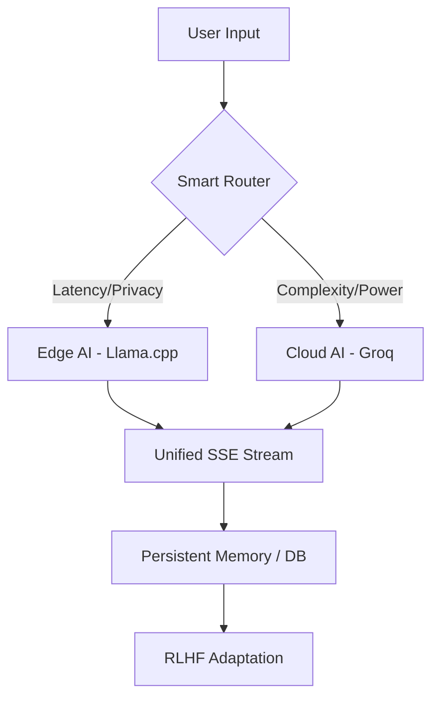

# 🧬 HELIX AI: Hybrid Edge + Cloud Intelligence

> **Production-Grade Hybrid AI System** — Seamlessly bridging Local Edge AI with High-Performance Cloud Intelligence and Autonomous Marketing.

---

## 🚀 The Vision

HELIX AI is a next-generation hybrid AI platform designed to provide **uninterrupted intelligence**. By dynamically routing requests between local device-side inference (Edge) and robust cloud-based models (Cloud), HELIX ensures privacy, speed, and reliability regardless of network conditions.

---

## 🏗️ Unified Hybrid Architecture

HELIX uses an **Adaptive Orchestrator** to manage model execution across two major dimensions:

1.  **FastAPI Backend (`helix_backend.fullstack`)**:
    *   **Unified API**: Standardized endpoints for both personality-driven chat and enterprise-grade marketing workflows.
    *   **Adaptive Inference Layer**: Intelligently routes requests between local inference (`llama-server.exe`) and cloud providers (`Groq/Llama-3.1`) based on complexity and availability.
    *   **Persistence Layer**: A resilient Supabase-integrated repository that automatically falls back to local memory if connectivity is lost.

2.  **Edge Engine Sidecar**:
    *   Uses a dedicated `llama-server.exe` to run GGUF quantized models locally on the host machine.
    *   Ensures that privacy-sensitive interactions (Privacy Mode) remain fully offline.

### System Flow

---

## ⚡ Core Modules

### 1. Autonomous Marketing Agent
A full-stack automation system that handles the entire marketing lifecycle:
*   **Brand Brain**: Persists and applies unique brand voices and specific vocabulary.
*   **Strategy & Generation**: Generates end-to-end campaign strategies and platform-specific content variants.
*   **Scheduler & Delivery**: Manages job queues for future posts with built-in "dry-run" safety checks and "live" platform dispatch.
*   **Optimization**: Records engagement metrics to refine future strategies via feedback loops.

### 2. Conversational Intelligence
*   **Suzi & Helix Personas**: Specialized AI personalities with distinct traits.
*   **RL-Layer**: A Reinforcement Learning layer tracks user sentiment and rewards, adapting response policies in real-time.
*   **Smart Streaming**: Token-by-token streaming with live performance metrics (`t/s` and `latency`).

### 3. Android Edge AI Prototype 📱
*   **Local Engine**: `libllama.so` (JNI) integration for on-device GGUF execution.
*   **Sync**: Automatically pings the Cloud backend when online; falls back to local core when offline.

---

## 🛠️ Quick Start

### Backend Setup
1. **Clone**: `git clone https://github.com/mlwithharsh/HELIX-AI`
2. **Setup Venv**: `python -m venv .venv` and activate it.
3. **Install**: `pip install -r helix_backend/requirements_fullstack.txt`
4. **Launch**: `python -m uvicorn helix_backend.fullstack.main:app --port 8000`

### Web Frontend
1. **Navigate**: `cd helix-frontend`
2. **Install**: `npm install`
3. **Run**: `npm run dev`

---

## 📚 Documentation Deep Dive

Explore the specialized guides for each part of the HELIX ecosystem:

| Guide | Description |
| :--- | :--- |
| [**HELIX Overview**](./HELIX_OVERVIEW.md) | High-level architecture and system design. |
| [**Fullstack Setup**](./FULLSTACK_SETUP.md) | Technical guide for setting up the FastAPI backend and database. |
| [**Marketing System Walkthrough**](./HELIX_LOCAL_MARKETING_SYSTEM_WALKTHROUGH.md) | Detailed deep-dive into the Autonomous Marketing Agent. |
| [**Marketing Launch Checklist**](./HELIX_MARKETING_LOCAL_LAUNCH_CHECKLIST.md) | Steps to verify and go live with the marketing engine. |
| [**RL & Personality Core**](./README_RL.md) | How the Suzi/Helix personalities adapt using Reinforcement Learning. |
| [**Edge Validation Report**](./EDGE_VALIDATION_REPORT.md) | Benchmarks for local GGUF inference and system performance. |
| [**Changelog**](./CHANGELOG.md) | Version history and latest feature updates. |

---

## 📊 Performance Benchmarks
| Mode  | Tokens/Sec (Avg) | Latency (First Token) | Privacy | 
|-------|------------------|-----------------------|---------|
| Edge  | 8-12 t/s         | < 100ms               | High    |
| Cloud | 40-70 t/s        | ~300ms                | Medium  |

---
*HELIX AI evolves from the initial work on ECHO AI and continues to grow with community input.*
*Created by the Google Deepmind Team - Advanced Agentic Coding.*
